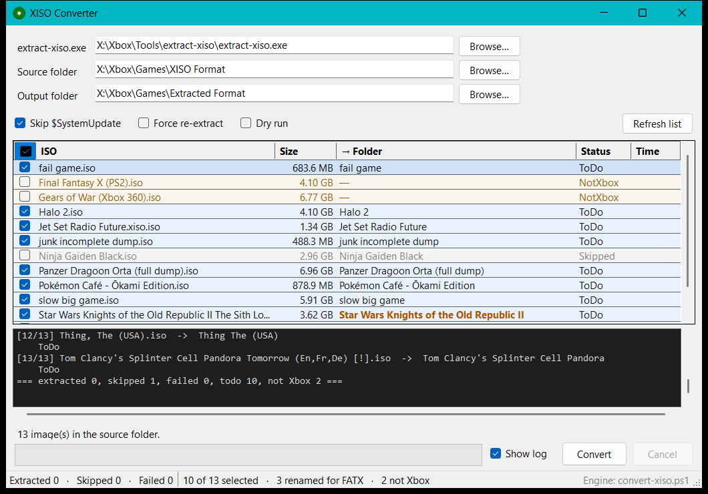

# XISO Converter

A Windows desktop front-end for bulk-converting Original Xbox XISO images into
extracted game folders, named so they survive the trip to the console.

Built to [docs/GUI-SPEC.md](docs/GUI-SPEC.md). The user-facing manual that ships with
the release is [release/README.md](release/README.md).

MIT licensed ([LICENSE](LICENSE)). Bundled third-party software keeps its own terms —
see [THIRD-PARTY-NOTICES.md](THIRD-PARTY-NOTICES.md).



---

## What it does

Three things, and deliberately nothing else:

1. **Bulk convert** every new XISO in a source folder into an extracted game folder.
2. **Name folders so they work on the Xbox** — FATX rules, described below.
3. **Skip what's already converted**, so it can be re-run as downloads finish.

The GUI does not convert anything itself. It shells out to `convert-xiso.ps1 -Json` and
renders the newline-delimited JSON event stream that comes back. Every naming, skipping
and extraction rule lives in that one script, so there is no second implementation to
drift out of sync.

### The rules that matter

FATX — the Xbox filesystem — is stricter than Windows in ways that fail late and
confusingly:

- Names cap at **42 characters**.
- `" * + , / : ; < = > ? \ |` are illegal. Comma, plus, semicolon and equals are all
  legal on Windows, so `Thing, The (USA)` copies fine on the PC and then fails over FTP
  with `550 Filename invalid`.
- Over-length names are shortened in order: bracketed tags, then trailing region/dump
  junk, then a leading article, and only cut mid-title as a last resort.
- Extraction goes to a `<name>.partial` folder, renamed only after extract-xiso exits
  clean **and** `default.xbe` is confirmed present — so a cancelled run never leaves a
  folder that looks finished.
- Folders from earlier naming rules are renamed rather than re-extracted.

If the GUI needs behaviour the script doesn't have, the rule is to **add a parameter to
the script**, not fork the logic into C#. That has happened twice; both are documented
at the bottom of this file.

---

## Dependencies

### To run a release build

| | |
|---|---|
| Windows | 10 or 11, 64-bit |
| .NET | **none** — the release `.exe` is self-contained |
| PowerShell | Windows PowerShell 5.1, which ships with Windows |
| `extract-xiso.exe` | **bundled** in published releases; the app finds it automatically |

Published releases need nothing installed at all. A `-FrameworkDependent` build is
~1 MB instead of ~63 MB but needs the **.NET 8 Desktop Runtime**.

### To build

| | |
|---|---|
| .NET 8 SDK | `winget install Microsoft.DotNet.SDK.8` |

That's the whole list. **No NuGet packages** — the app uses only the base class
library and `System.Text.Json`, both in-box. Nothing to restore beyond the framework
reference itself.

### To run the test suite by hand

Nothing extra. `tools/FakeExtractXiso` stands in for `extract-xiso.exe` and
`tools/New-TestLibrary.ps1` fabricates a library, so neither real ISOs nor a console
are needed.

---

## Building

```powershell
# what CI publishes
.\tools\Get-ExtractXiso.ps1        # fetch the pinned extract-xiso, once
.\build.ps1 -BundleTool -Zip

# development
dotnet build XisoConverter.sln
dotnet run --project src\XisoConverterGui
```

| Command | Result |
|---|---|
| `.\build.ps1` | self-contained drop in `dist\XisoConverter\` |
| `.\build.ps1 -Zip` | the above, plus `dist\XisoConverter-<version>.zip` |
| `.\build.ps1 -BundleTool` | includes extract-xiso and its licence |
| `.\build.ps1 -FrameworkDependent` | ~1 MB `.exe`, needs the .NET 8 Desktop Runtime |
| `.\build.ps1 -Version 1.2.3` | stamps the `.exe` and names the zip |
| `.\build.ps1 -Configuration Debug` | Debug drop in the shipped layout |

The published drop:

```
dist\XisoConverter\
    XisoConverter.exe          self-contained, no runtime prerequisite
    convert-xiso.ps1           the engine, must stay beside the .exe
    README.md                  the user manual
    THIRD-PARTY-NOTICES.md     licences and attribution
    extract-xiso\
        extract-xiso.exe       bundled unmodified
        LICENSE.TXT            required by its licence
        VERSION.txt            which upstream build
```

`dist\` is gitignored — it is a build output, never a source of truth.

`convert-xiso.ps1`, `release/README.md` and `THIRD-PARTY-NOTICES.md` are copied into
the output on every build, so `dotnet publish` alone also produces a usable drop. The
Debug build gets the script too, and the app walks up parent folders to find both it
and `third-party\extract-xiso\`, so a development build behaves like a bundled release.

## Testing

```powershell
.\tools\Invoke-Tests.ps1
```

38 assertions against the engine — every status path, the FATX naming rules, the
media-signature check, `-IncludeFile`, `-NoMediaCheck`, the exit codes, and that
non-ASCII survives the JSON stream. It runs the engine exactly the way the GUI does
(Windows PowerShell 5.1, `-Command` bootstrap, UTF-8 forced, arguments via the
environment), so the encoding bug that bit us once is covered. Exits non-zero on
failure; CI gates releases on it.

## Releasing

Releases are built and published by GitHub Actions
([.github/workflows/release.yml](.github/workflows/release.yml)):

```powershell
git tag v1.0.0
git push origin v1.0.0
```

The workflow builds, fetches the pinned extract-xiso, runs the test suite, produces the
bundled drop stamped with the tag's version, verifies every required file is present —
including the third-party licence — and then creates the GitHub Release with the zip
attached. There is also a `workflow_dispatch` trigger that takes a version and defaults
to publishing a **draft**, so a release can be reviewed before anyone sees it.

[.github/workflows/ci.yml](.github/workflows/ci.yml) runs the same build and tests on
every push and pull request, and uploads the drop as an artifact.

Bumping the bundled extract-xiso is a one-line change: the pinned tag lives at the top
of [tools/Get-ExtractXiso.ps1](tools/Get-ExtractXiso.ps1). It is deliberately pinned
rather than tracking latest, so a rebuild of an old tag produces the same bytes.

**Releases are unsigned.** SmartScreen will show "Windows protected your PC" on first
run, and self-contained single-file .NET binaries are a common source of antivirus false
positives. The release notes and the shipped manual both explain the *More info → Run
anyway* path and the zip **Unblock** step, and point at the source rather than telling
anyone to disable their antivirus. Removing the warning entirely needs a paid code
signing certificate; if one is ever bought, sign `dist\XisoConverter\XisoConverter.exe`
after `build.ps1` and before zipping.

---

## Layout

```
xbox-iso-bulk-conversion-gui-tool/
├── build.ps1                       one command to produce the release drop
├── convert-xiso.ps1                the engine - the GUI shells out to this
├── Directory.Build.props           version and language settings shared by both projects
├── XisoConverter.sln
├── docs/
│   ├── GUI-SPEC.md                 the brief this was built to
│   └── screenshots/
├── release/
│   └── README.md                   user manual, copied into the release drop
├── src/
│   └── XisoConverterGui/
│       ├── XisoConverterGui.csproj
│       ├── Program.cs              entry point and last-resort crash handler
│       ├── app.ico
│       ├── Engine/
│       │   ├── ConverterRunner.cs  launches the script, streams stdout, kills the tree on cancel
│       │   └── ConverterEvent.cs   one NDJSON line off the wire
│       ├── Model/
│       │   ├── GameRow.cs          row state, FATX rename detection, size/duration formatting
│       │   └── AppSettings.cs      %APPDATA%\XisoConverter\settings.json
│       └── Ui/
│           ├── MainForm.cs         event handling, grid state, run lifecycle
│           ├── MainForm.Ui.cs      control construction and layout
│           ├── SummaryDialog.cs    end-of-run report
│           └── Palette.cs          row colours
├── tools/
│   ├── FakeExtractXiso/            test stub standing in for extract-xiso.exe
│   ├── New-TestLibrary.ps1         builds the scratch ISO library
│   └── New-AppIcon.ps1             regenerates app.ico
└── dist/                           build output (gitignored)
```

---

## How it hangs together

**Process model.** `ConverterRunner` starts PowerShell with
`RedirectStandardOutput`, `UseShellExecute = false`, `CreateNoWindow = true`, and reads
stdout a line at a time with `ReadLineAsync` on a background task. Nothing is buffered
to the end — the grid updates as each event lands.

**Threading.** Events are raised on the reader thread. High-frequency `log` events go
into a `ConcurrentQueue` drained by a 150 ms UI timer and appended in one batch, so a
chatty extract-xiso can't bog the message pump down. Every other event is marshalled
onto the UI thread with `BeginInvoke`. The log pane is capped at 400 000 characters.

**Cancel.** `CancellationToken` registration calls `Process.Kill(entireProcessTree:
true)`. The script's `.partial` design means a killed run can't leave a folder that
looks finished; the GUI then deletes any `<Output>\*.partial` left behind and marks the
interrupted row `Cancelled`.

**Grid.** Unbound `DataGridView`, so column sorting comes for free. Size and Time cells
hold `long`/`double` and are humanised in `CellFormatting`, which keeps sorting numeric
rather than alphabetic. Rows are looked up by ISO filename rather than index, because
an `-IncludeFile` run renumbers the images it sees.

**Settings.** Load never throws — a missing, truncated or hand-mangled
`settings.json` yields defaults. Window position is only restored if it still lands on
a connected monitor.

---

## Testing without real ISOs

```powershell
.\tools\New-TestLibrary.ps1 -Clean      # creates %TEMP%\XisoConverterTest
dotnet build XisoConverter.sln
dotnet run --project src\XisoConverterGui
```

Point the three paths at `tools\FakeExtractXiso\bin\Debug\net8.0\fake-extract-xiso.exe`
and the two folders under `%TEMP%\XisoConverterTest`. The images are sparse — a "4 GB"
library costs nothing on disk — and each one meant to look like an Xbox disc gets a real
`MICROSOFT*XBOX*MEDIA` signature written at the correct offset.

| Image | Exercises |
|---|---|
| `Thing, The (USA).iso` | comma stripped for FATX → `Thing The (USA)` |
| `Star Wars Knights of the Old Republic II The Sith Lords (USA).xiso.iso` | 42-character shortening |
| `Pokémon Café - Ōkami Edition.iso` | non-ASCII round-trip through the JSON stream |
| `Tom Clancy's Splinter Cell Pandora Tomorrow (En,Fr,De) [!].iso` | bracketed tags dropped |
| `fail game.iso` | extract-xiso exits non-zero → `Failed` |
| `junk incomplete dump.iso` | exits clean but writes no `default.xbe` → `Failed` |
| `slow big game.iso` | ~25 seconds, so there is something to cancel |
| `Ninja Gaiden Black.iso` | already extracted → `Skipped` |
| `Jet Set Radio Future.xiso.iso` | folder under an older naming rule → renamed, not re-extracted |
| `Panzer Dragoon Orta (full dump).iso` | signature at the redump offset, not the trimmed one |
| `Final Fantasy X (PS2).iso`, `Gears of War (Xbox 360).iso` | no signature → `NotXbox` |

The stub keys off the filename: `fail*` exits 1, `junk*` exits 0 without writing
`default.xbe`, and anything containing `slow` takes its time.

---

## Images that aren't Xbox games

Before anything touches the disk, each image is checked for the 20-byte
`MICROSOFT*XBOX*MEDIA` signature that every Original Xbox disc carries at sector 32 of
its game partition — offset `0x10000` in a trimmed/xiso image, `0x18310000` in a
redump-style full dump ([convert-xiso.ps1:105-140](convert-xiso.ps1#L105-L140)).

An image with no signature gets status `NotXbox`: the row stays visible, greyed and
unticked, and the run leaves it alone. Nothing is hidden, so a false negative on an
unusual dump can't make a real game silently vanish. `NotXbox` is not a failure — the
exit code stays `0`.

To override, tick the row and convert anyway; the GUI notices and passes
`-NoMediaCheck` for that run. On the command line, pass `-NoMediaCheck` yourself.

Without this the image would still be handled safely — extract-xiso exits non-zero and
the `.partial` folder is deleted — but the reported reason would be
`extract-xiso exited with code 1`, indistinguishable from a corrupt download. The check
exists to make that distinction, not to prevent damage.

---

## Three decisions worth knowing about

**The script is launched via `-Command`, not `-File`.** The spec's invocation is
`powershell -File "Convert-Xiso.ps1" -Json …`, but Windows PowerShell 5.1 transcodes
redirected stdout through the OEM code page and replaces every non-ASCII character with
`?`. `Pokémon Café - Ōkami Edition.iso` arrives as `Pok?mon Caf? - ?kami`, and no
`StandardOutputEncoding` on the parent side can recover it — the data is already gone in
the child. So the child is launched as:

```
powershell -NoProfile -ExecutionPolicy Bypass -Command
    "[Console]::OutputEncoding = [System.Text.UTF8Encoding]::new($false);
     & $env:XC_SCRIPT -Json -ExtractXiso $env:XC_TOOL … ; exit ([int]$LASTEXITCODE)"
```

Forcing the encoding first makes the stream lossless. Every path travels in an
environment variable rather than on the command line, so spaces, quotes, ampersands and
`$` in a folder name cannot be mangled by quoting. Exit codes propagate unchanged
(verified for 0, 1 and 2). The parameters the script receives are exactly the ones the
spec documents.

**`convert-xiso.ps1` gained `-Include` / `-IncludeFile`.** The grid's checkbox column is
"include in run", but the script had no way to run a subset — it always processed the
whole source folder. Per the spec's own rule, it now takes an optional list of image
filenames and narrows `$isos` to those. Nothing else changed: naming, skipping,
`.partial` promotion and extraction are untouched, and with no filter the behaviour is
identical to before. The GUI passes `-IncludeFile` (a temp file, one name per line)
rather than `-Include` so a large selection cannot overflow the command line, and passes
nothing at all when every row is ticked.

**`convert-xiso.ps1` gained `-NoMediaCheck`.** The media-signature check above needed an
escape hatch, or ticking a misdetected row would have done nothing.

---

## Thanks to

This is a front-end. The hard parts were solved by other people first.

- **[extract-xiso](https://github.com/XboxDev/extract-xiso)** — does all the actual
  extraction; this project would have nothing to do without it. Maintained by the
  **[XboxDev](https://github.com/XboxDev)** project, building on the work of its
  original author, *in* &lt;in@fishtank.com&gt;.

  > This product includes software developed by in &lt;in@fishtank.com&gt;.

  Published releases bundle it **unmodified** under its 4-clause BSD licence, with that
  licence alongside it. It is *not* committed to this repository — it is fetched from
  its own project at a pinned version at build time. Neither *in* nor the XboxDev
  project endorses this software. See
  [THIRD-PARTY-NOTICES.md](THIRD-PARTY-NOTICES.md).
- **[Redump](http://redump.org)** — disc preservation work, and the source of the
  full-dump layout the media check recognises.
- The wider **Original Xbox homebrew community**, whose documentation of the disc format
  and of FATX's limits is what makes the naming rules possible at all.
- **[.NET](https://github.com/dotnet/runtime)** and
  **[Windows Forms](https://github.com/dotnet/winforms)** — MIT-licensed, and what the
  app is built on.
- **[PowerShell](https://github.com/PowerShell/PowerShell)** — the engine is a
  PowerShell script, and the whole design leans on it being present on every Windows
  machine.
